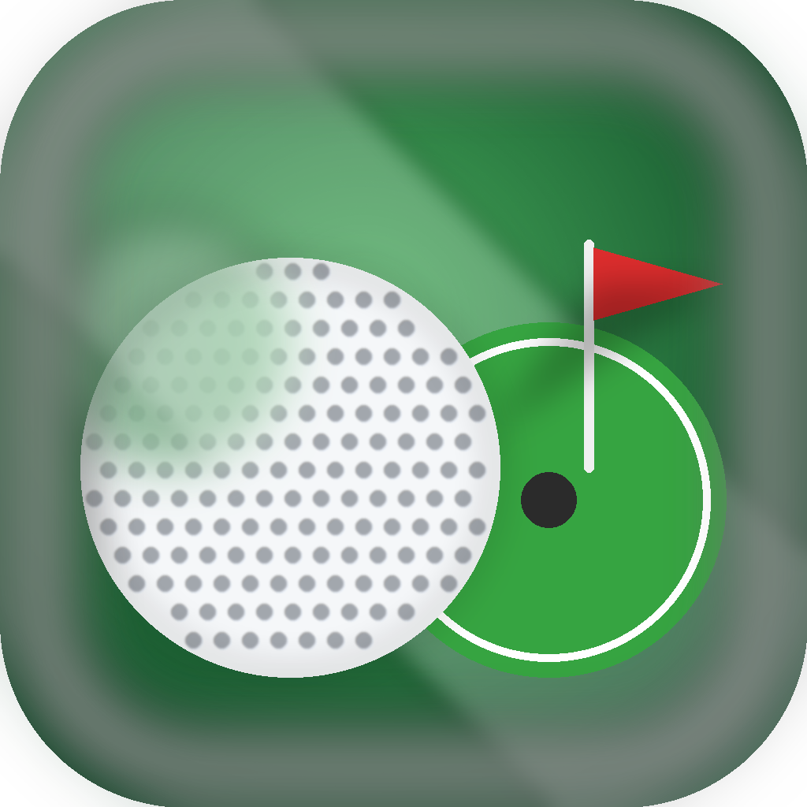

# GreenShot 🏌️

<div align="center">
  

  **A premium iOS golf game featuring procedural course generation, realistic physics, and Game Center integration**

  [](https://swift.org)
  [](https://developer.apple.com/ios/)
  [](https://developer.apple.com/spritekit/)
  [](https://developer.apple.com/swiftui/)
</div>

## ✨ Features

### 🎮 Core Gameplay
- **Procedural Course Generation** - Unique 9-hole courses with varying difficulties
- **Realistic Physics** - Ball physics with damping, friction, and collision detection
- **Professional Scoring** - Complete golf scoring system (eagles, birdies, pars, bogeys)
- **Intelligent Camera** - Smooth ball following with auto-zoom and manual pan/zoom
- **Interactive Controls** - Intuitive drag-to-shoot with trajectory preview

### 🏆 Game Center Integration
- **Leaderboards** - Global and friends leaderboards
- **Achievements** - Unlock achievements for various accomplishments
- **Player Profiles** - Game Center authentication and player stats
- **Multiplayer Ready** - Infrastructure for real-time multiplayer (coming soon)

### 🎨 Visual Features
- **Broadcast-Style HUD** - Professional golf broadcast interface
- **Dynamic Effects** - Celebration animations, ball trails, and particle effects
- **Customizable Settings** - Control visual effects, camera behavior, and performance
- **Responsive Design** - Optimized for all iPhone and iPad screen sizes

### ⚙️ Technical Excellence
- **Clean Architecture** - Domain-driven design with clear separation of concerns
- **High Performance** - Optimized for 60fps gameplay with advanced rendering techniques
- **Comprehensive Testing** - Full unit test coverage for core game logic
- **Modern Swift** - Built with Swift 5.9, SwiftUI, and latest iOS APIs

## 🚀 Quick Start

### Prerequisites
- **Xcode 15.0+**
- **iOS 17.0+** deployment target
- **macOS 14.0+** for development

### Installation
1. **Clone the repository**
   ```bash
   git clone https://github.com/VirenMohindra/greenshot.git
   cd runner
   ```

2. **Open in Xcode**
   ```bash
   open runner.xcodeproj
   ```

3. **Build and run**
   - Select your target device/simulator
   - Press `Cmd+R` to build and run

### Alternative: Command Line Build
```bash
# Build for iOS Simulator
xcodebuild -scheme runner -destination "platform=iOS Simulator,name=iPhone 16" build

# Run tests
xcodebuild test -scheme runner -destination "platform=iOS Simulator,name=iPhone 16"

# Clean build
xcodebuild -scheme runner clean
```

## 🏗️ Architecture

GreenShot follows **Clean Architecture** principles with **Domain-Driven Design**:

```
┌─────────────────────────────────────────────────────────┐
│                  Presentation Layer                     │
│  SwiftUI Views • ViewModels • CleanGameScene            │
├─────────────────────────────────────────────────────────┤
│                  Application Layer                      │
│  Use Cases • Controllers • Game State Management        │
├─────────────────────────────────────────────────────────┤
│                   Domain Layer                          │
│  Entities • Value Objects • Business Services           │
├─────────────────────────────────────────────────────────┤
│                Infrastructure Layer                     │
│  SpriteKit • Physics • Rendering • Persistence          │
└─────────────────────────────────────────────────────────┘
```

### Key Components
- **Domain**: Core golf game logic and rules
- **Application**: Use cases and game coordination
- **Infrastructure**: SpriteKit rendering and platform services
- **Presentation**: SwiftUI interface and reactive view models
- **DI Container**: Dependency injection with service lifecycles

## 🎯 Performance Optimizations

Recent performance improvements deliver **60fps** gameplay:

- **95% reduction** in rendering node operations
- **Object pooling** for particles and UI elements
- **Throttled updates** (camera 20fps, trails 30fps)
- **Texture optimization** with 50% density reduction
- **Memory management** with proper cleanup cycles

## 🛠️ Development

### Project Structure
```
runner/
├── Domain/             # Business logic and entities
├── Application/        # Use cases and controllers
├── Infrastructure/     # Platform implementations
├── Presentation/       # SwiftUI views and ViewModels
├── DI/                 # Dependency injection container
└── Game/               # SpriteKit scene orchestration
```

### Key Development Commands
```bash
# Run all tests
xcodebuild test -scheme runner -destination "platform=iOS Simulator,name=iPhone 16"

# Run specific test class
xcodebuild test -scheme runner -only-testing:GreenShotTests

# Debug build with environment switching
# Set selected_environment in UserDefaults for staging/development
```

### Testing Strategy
- **Unit Tests**: Core domain services (physics, scoring, generation)
- **Integration Tests**: Component interaction and data flow
- **UI Tests**: End-to-end gameplay scenarios
- **Performance Tests**: Frame rate and memory benchmarks

## ⚙️ Configuration

### Environment Management
Switch between Production, Staging, and Development:
- **Runtime**: Settings → Environment (Debug builds only)
- **Launch Arguments**: `FORCE_ENVIRONMENT=production/staging/development`
- **UserDefaults**: Set `selected_environment` key

### Game Settings
- **Visual Effects**: Control radius, trajectory preview, ball trails
- **Camera Behavior**: Follow speed, auto-zoom, smoothing
- **Performance**: Effect quality, rendering optimizations
- **Audio**: Sound effects, music, haptic feedback

## 🧪 Testing

### Run Tests
```bash
# All tests
xcodebuild test -scheme runner -destination "platform=iOS Simulator,name=iPhone 16"

# Specific test suite
xcodebuild test -scheme runner -only-testing:GreenShotTests/PhysicsServiceTests

# UI tests only
xcodebuild test -scheme runner -only-testing:GreenShotUITests
```

### Test Coverage
- **PhysicsService**: Shot calculations, trajectories, collisions
- **ScoringService**: Golf scoring rules, celebration levels
- **HoleGeneration**: Course generation, obstacle placement
- **GameController**: Game state management, hole completion

## 📱 System Requirements

### Minimum Requirements
- **iOS 17.0+**
- **iPhone 12** or newer (recommended)
- **iPad Air 4th gen** or newer (recommended)
- **1GB RAM** available for optimal performance

### Recommended Specifications
- **iOS 18.0+**
- **iPhone 15** or newer
- **iPad Pro** with M1/M2 chip
- **Game Center** account for leaderboards and achievements

## 🤝 Contributing

### Development Setup
1. Fork the repository
2. Create a feature branch: `git checkout -b feature/amazing-feature`
3. Follow the coding standards in `CLAUDE.md`
4. Ensure all tests pass: `xcodebuild test -scheme runner`
5. Commit with conventional commits: `git commit -m 'feat: add amazing feature'`
6. Push and create a Pull Request

### Code Standards
- **Clean Architecture** principles
- **Domain-driven design** patterns
- **Comprehensive unit tests** for new features
- **Performance-first** implementation approach
- **SwiftUI + SpriteKit** hybrid architecture

## 📄 License

This project is licensed under the MIT License - see the LICENSE file for details.

## 🙏 Acknowledgments

- **SpriteKit** for powerful 2D game engine capabilities
- **SwiftUI** for modern, reactive user interface design
- **Game Center** for social gaming features
- **Clean Architecture** principles by Robert C. Martin
- **Domain-Driven Design** concepts by Eric Evans

---

<div align="center">
  <p><strong>Built with ❤️ and Swift</strong></p>
  <p>Ready to tee off? Download and start playing! 🏌️‍♂️</p>
</div>
